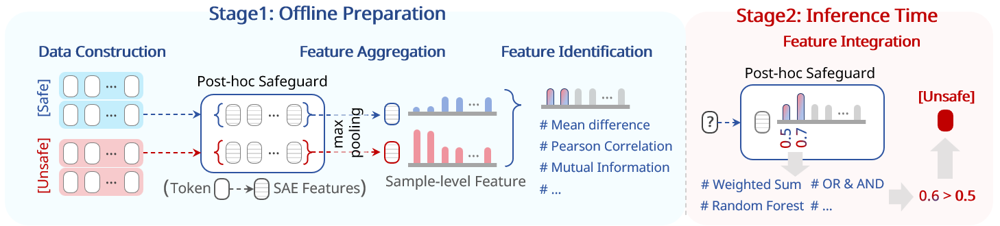

# NExTGuard

**Training-Free Streaming Safeguard with Zero Token-Level Labels**

[](https://www.python.org/downloads/)
[](https://opensource.org/licenses/MIT)
[](https://github.com/)


🌟 Transform post-hoc safety models into effective streaming safeguards using Sparse Autoencoders (SAEs).

🚀 Achieves **competitive** streaming detection performance comparable to supervised baselines, **without expensive model re-training**.



We are dedicated to investigating the significance of internal model representations for safety and exploring the upper bounds of safety capabilities in base models (without supervised fine-tuning). This work represents a preliminary step, and this repository will be continuously updated.

> **Note**: The comprehensive **Streaming Safety Benchmark (SSB)** and the refined dataset used in our paper are currently being finalized and will be released **Coming Soon**! Stay tuned.

For the performance and details of the baseline model **Qwen3Guard**, please refer to [Nashchennc/Qwen3Guard](https://github.com/Nashchennc/Qwen3Guard). We also provide visualization tools and dataset adapters.

## 🛠️ Installation

Install the package in editable mode:

```bash
pip install -e .
```
## 📂 Project Structure & Usage

### 1. Configuration

Configure your local paths in a `.env` file at the project root:

```env
MODEL_ROOT=./models
SAE_ROOT=./sae_checkpoints
DATASET_ROOT=./datasets
```

Paths about models/saes/datasets in this repo are relative paths based on these roots. You can check your dataset config (and download datasets that fit the config) by running `download_datasets.py`. We currently support standard safety benchmarks including Aegis, BeaverTails, and more (see `src/sae_tools/data_loader`).

## 2. Model Preparation

Before running the code, please ensure you have downloaded the **Base LLM** and the corresponding **SAE checkpoints** (e.g., from HuggingFace) to your local machine.

* **Base Model**: e.g., Qwen/Qwen3-8B
* **SAE Checkpoint**: Compatible SAEs trained on the base model layers.

🌟 **Recommended Setup**: The default configuration in our code uses Qwen/Qwen3Guard-Gen-8B combined with the corresponding SAEs released by @adamkarvonen, which represents the best-performing combination in our experiments.

---

## 3. How to Use

This repository implements the two-stage pipeline described in the paper:

### Stage 1: Offline Preparation (Feature Identification)

Extract SAE activations and construct safety indicators via statistical filtering and aggregation (Section 3.1).

> 💡 Note on Interpretability & Performance: To bridge the gap between Base SAE features and complex safety concepts, we employ a sparse weighting mechanism. While this significantly enhances detection coverage and stability (F1 score), it involves a trade-off: the resulting detector relies on a weighted combination of features rather than single-feature activation, shifting the focus from atomic interpretability to distributed safety signal detection.

* **Step 0: Generate Activations**
Run `0_generate_activations.py` to cache SAE latent activations on your calibration dataset.
```bash
python 0_generate_activations.py
```


* **Step 1: Statistical Selection**
Use `1_statistical.ipynb` to calculate the **Standardized Mean Difference** (Eq. 4) for each feature. This notebook will:
1. Compute the discriminative score  for all features.
2. Select the top-K safety-relevant features.
3. Export the `safety_features.json` config for inference.

* **(Optional) Step 2: Visualization**: Use `2_dashboard.ipynb` to manually inspect and verify the selected features on real examples.

### Stage 2: Offline Simulation & Evaluation

In this stage, we continue to work with the cached activations to simulate the streaming safeguard mechanism, refine parameters, and evaluate performance. This process is **not real-time** but simulates the intervention logic efficiently.

* **Step 3: Filter & Combination**
Run `3_filter_and_combination.ipynb` to:
1. Apply advanced filtering to the candidate features.
2. Experiment with feature combination strategies (e.g., weighted sum).
3. Save the final intervention parameters and thresholds.


* **Step 4: Evaluation**
Run `4_eval.ipynb` to perform the final assessment on the test set. This will output key metrics such as F1 score and Average Precision Delay (APD) to benchmark the safeguard's effectiveness.

